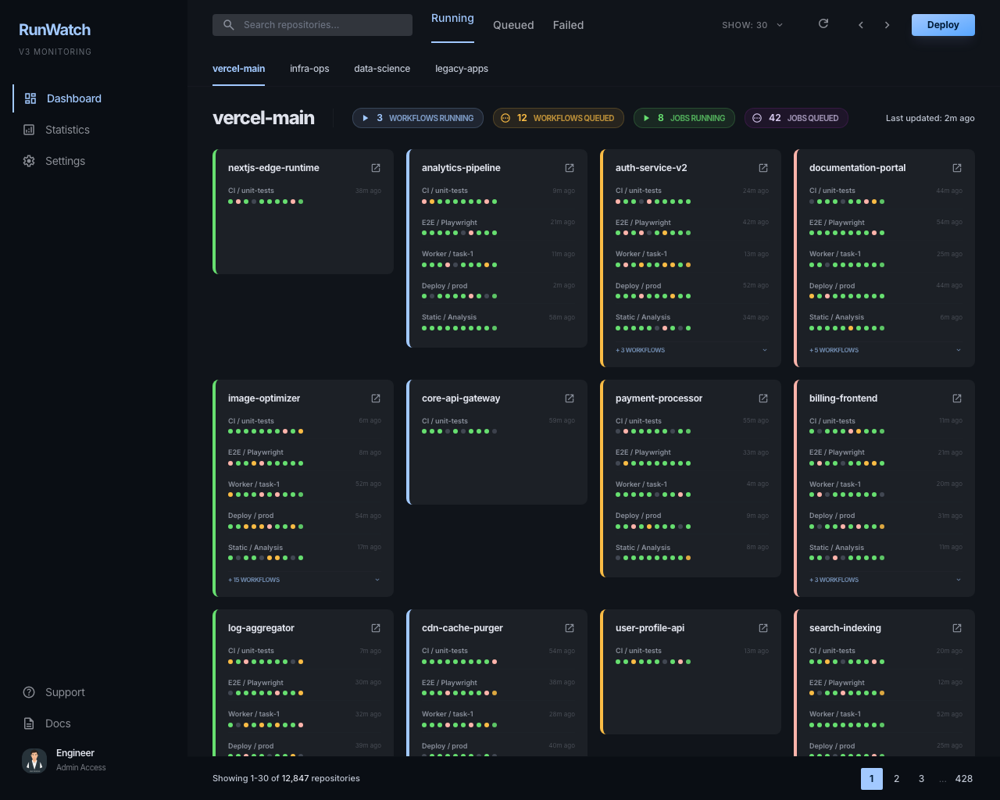
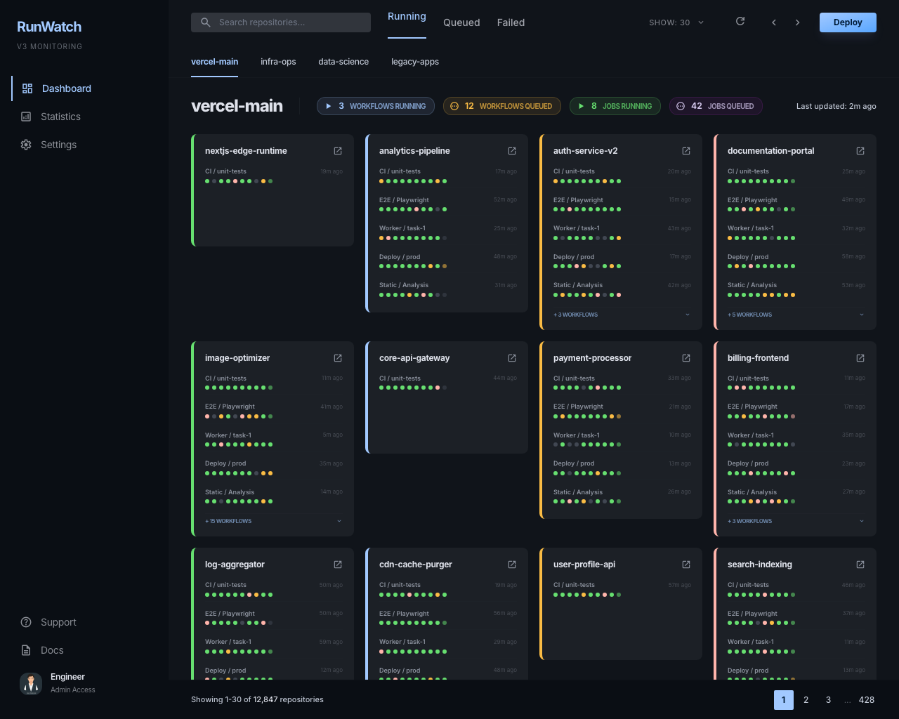
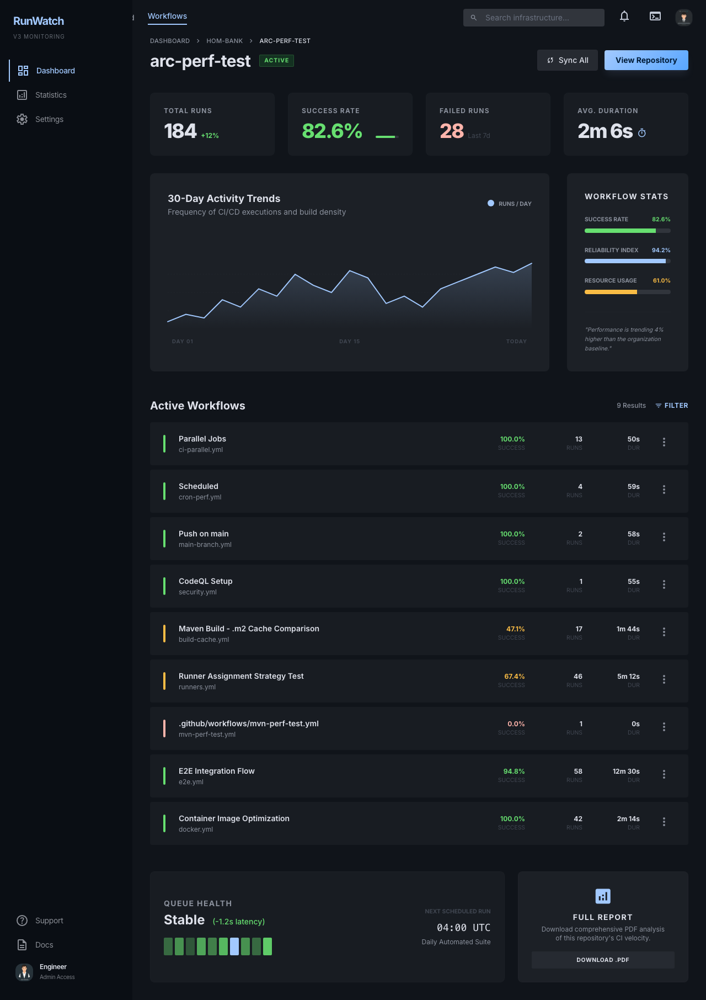
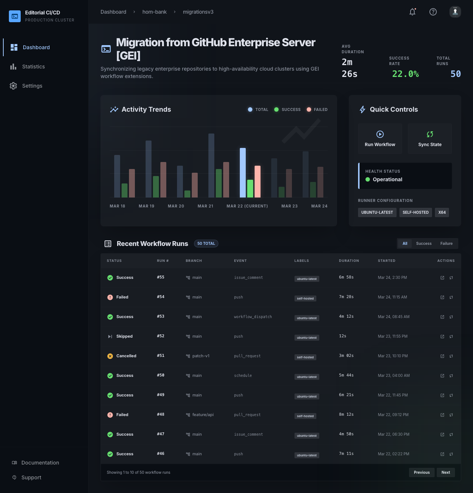
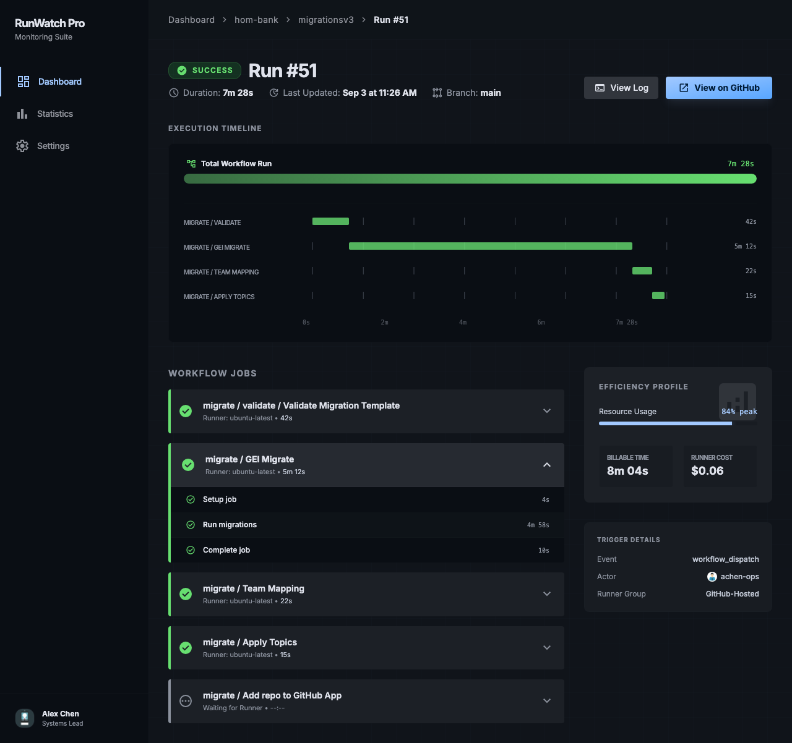
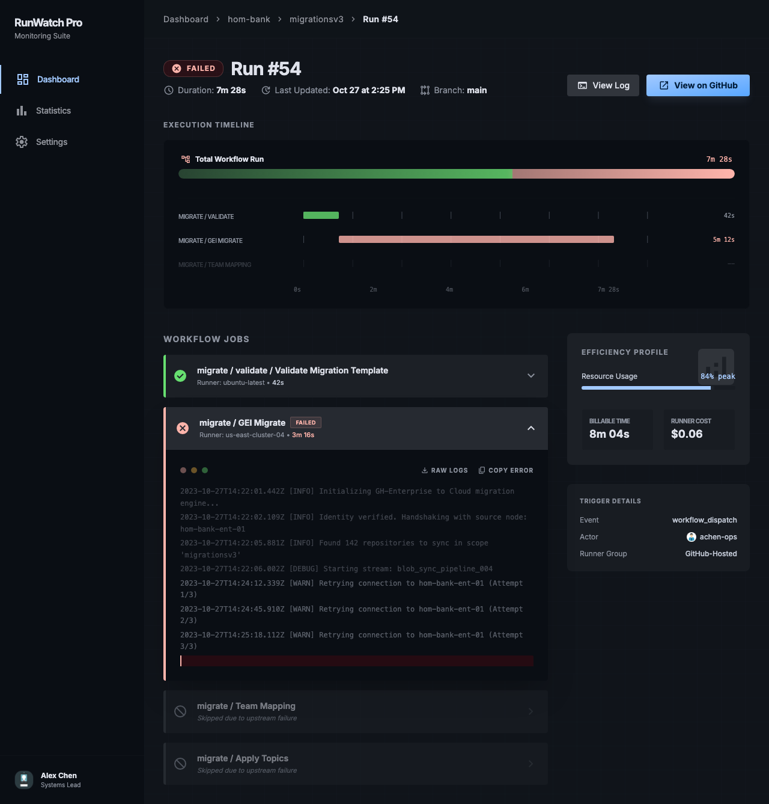
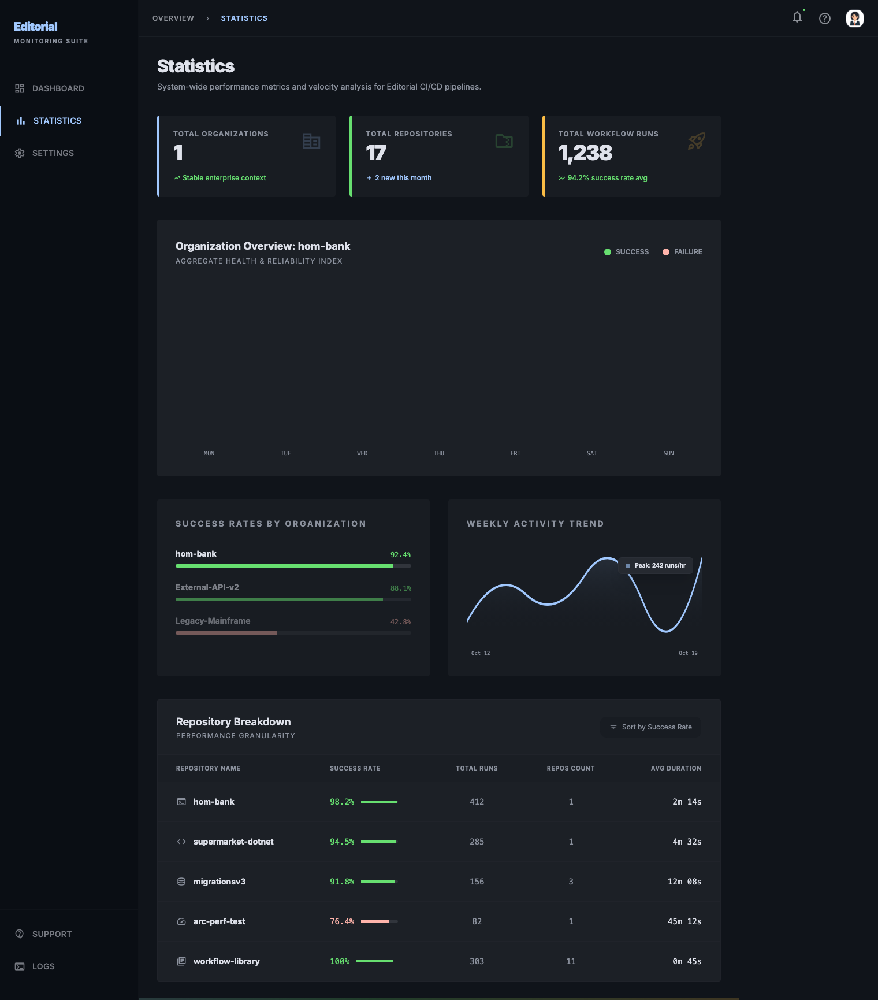
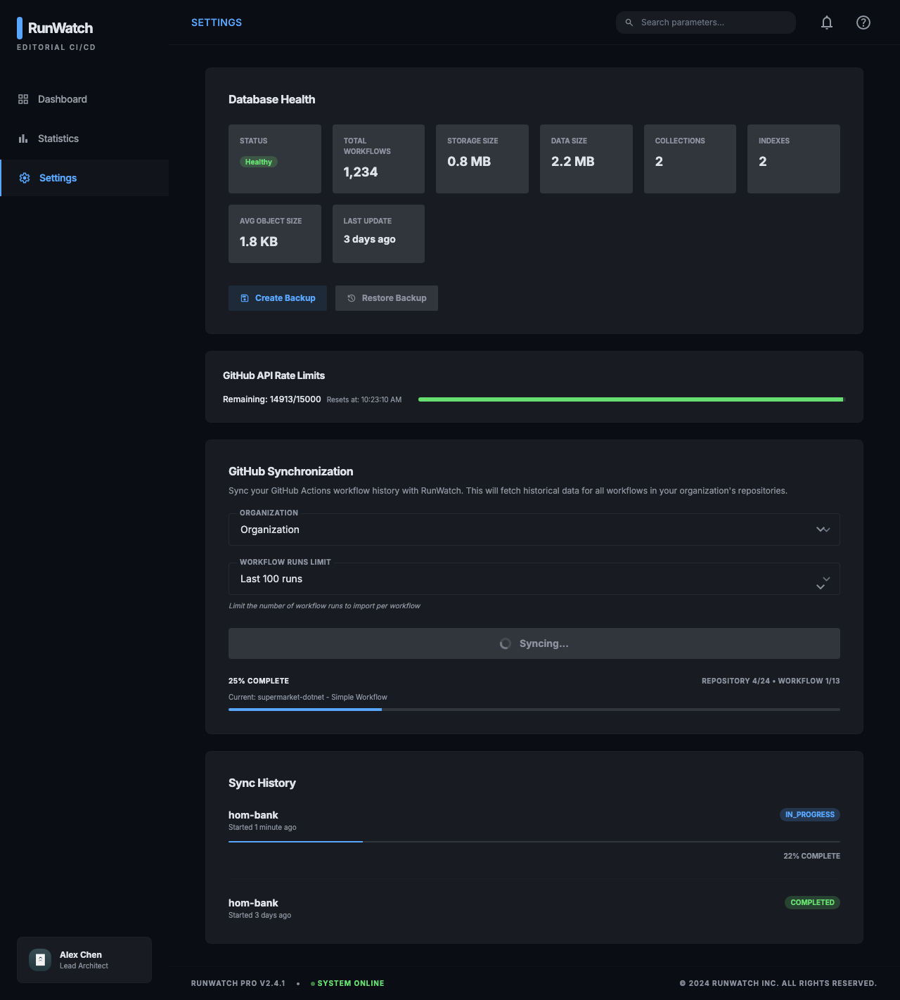
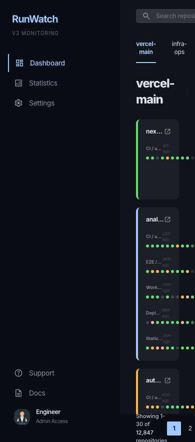

## Overview

This epic covers the complete UI redesign of RunWatch V3, replacing the current Material UI (MUI) based interface with a new custom design system built in Tailwind CSS. The redesign was prototyped in [Google Stitch](https://stitch.withgoogle.com/u/2/projects/10482653866747580445) and follows an "Editorial CI/CD Monitoring" aesthetic — a dark-mode, high-density command center with deep tonal layering, glassmorphism, and GitHub-inspired color semantics.

**Every existing view in the current application has a 1:1 redesigned counterpart in Stitch.** This issue documents the complete mapping, design specifications, and requirements for each view.

---

## Design System Summary

| Property | Value |
|----------|-------|
| **Theme** | Dark mode ("Sophisticated Technicality" / "Observational Monolith") |
| **Primary Color** | `#58a6ff` (GitHub blue) |
| **Secondary Color** | `#3fb950` / `#27a640` (success green) |
| **Tertiary Color** | `#d29922` (warning amber) |
| **Error Color** | `#ffb4ab` / `#93000a` |
| **Background** | `#10141a` (deep navy) |
| **Surface Hierarchy** | `#10141a` → `#181c22` → `#1c2026` → `#262a31` → `#31353c` |
| **Font** | Inter (all weights, variable) |
| **Roundness** | `0.375rem` (md) / `0.5rem` (lg) |
| **Framework** | Tailwind CSS (replacing MUI) |
| **Border Philosophy** | "No-Line Rule" — layout defined by tonal shifts, not borders |
| **Elevation** | Tonal layering + glassmorphism for floating elements |

### Key Design Principles
1. **No 1px borders** — Section boundaries via background color shifts only
2. **Glass & Gradient** — Floating elements use `backdrop-blur(12px)` at 70% opacity; primary CTAs use `linear-gradient(135deg, #a2c9ff, #58a6ff)`
3. **Terminal aesthetic** — Labels use `uppercase`, `0.05em` letter-spacing, monospace feel
4. **Tonal depth** — Components nest from `surface` → `surface-container-low` → `surface-container` → `surface-container-high`

---

## View-by-View Mapping

### 1. Dashboard → `RunWatch Dashboard - 5-Column Grid & Collapsible Workflows`

| | Current | Redesign |
|---|---|---|
| **Route** | `/` | `/` |
| **Component** | `Dashboard.jsx` | — |
| **Framework** | MUI `Grid2`, `Paper`, `Chip` | Tailwind grid, custom cards |
| **Stitch Screen** | `eb0ade9c007a433dbfad7e8f3eb52ef7` | [View in Stitch](https://stitch.withgoogle.com/u/2/projects/10482653866747580445) |


**Redesign Preview:**



<details><summary>📸 Dashboard — Hover Status Details variant</summary>



</details>

**Current state:** MUI-based grid showing repos as cards with workflow status chips, search, filter dropdown, pagination.

**Redesign specifications:**
- **Layout:** 5-column responsive grid (`grid-cols-5`) with repo cards, replacing MUI `Grid2`
- **Sidebar:** Fixed 240px left sidebar (`#0a0e14`) with RunWatch branding, navigation (Dashboard/Statistics/Settings), and user profile
- **Top bar:** Fixed header with frosted glass effect (`backdrop-blur-xl`), search input, notification/terminal icons, gradient "Add Repo" CTA
- **Navigation tabs:** "All Workflows", "Active", "Failed", "Queued" — replacing MUI filter dropdowns
- **Repo cards:** Dark tonal cards (`surface-container-low`) with:
  - Repo name + org badge
  - Workflow dots (color-coded: green=success, red=fail, amber=in-progress, gray=skipped)
  - Collapsible workflow list with "Show N more" toggle
  - Hover state with `surface-container-high` background transition
- **Pagination:** Numbered page buttons replacing MUI `Pagination`
- **Metrics header:** KPI chips showing "12 Active", "3 Failed", "156 Total" inline

**Additional variant:** `RunWatch Dashboard - Hover Status Details` (`3aa2822e99734b1980a56fd31cd513ad`) — shows hover tooltip with detailed status breakdown per workflow

---

### 2. Repository Detail → `Repository Detail - hom-bank/arc-perf-test (Final)`

| | Current | Redesign |
|---|---|---|
| **Route** | `/repository/:repoName` | `/repository/:repoName` |
| **Component** | `RepositoryView.jsx` | — |
| **Framework** | MUI `Paper`, `Card`, Chart.js | Tailwind cards, custom charts |
| **Stitch Screen** | `e9dadbf1478f468ba121350222d3962b` | [View in Stitch](https://stitch.withgoogle.com/u/2/projects/10482653866747580445) |


**Redesign Preview:**



**Current state:** MUI cards showing repo overview, workflow stats table, Chart.js line/bar charts for duration trends and success rates.

**Redesign specifications:**
- **Breadcrumb nav:** `Dashboard > hom-bank > arc-perf-test` with chevron separators
- **Header:** Repo name (3xl bold) + "Active" status badge + "Sync All" / "View Repository" CTA buttons
- **Metrics grid:** 4 KPI cards in a grid:
  - Success Rate (with circular progress indicator)
  - Total Runs
  - Average Duration
  - Active Workflows count
- **Health Overview section:** Bar chart showing success/failure distribution with "Workflow Reliability Index" header
- **Workflows list:** Cards per workflow with:
  - Workflow name + status indicator (left accent bar)
  - Last run time + duration
  - Mini sparkline showing recent trend
  - Expand arrow to view history
- **Recent Activity section:** Timeline-style list of recent runs with status, duration, commit info

---

### 3. Workflow History → `Workflow Detail - 10 Recent Runs`

| | Current | Redesign |
|---|---|---|
| **Route** | `/workflow-history/:repoName/:workflowName` | `/workflow-history/:repoName/:workflowName` |
| **Component** | `WorkflowHistory.jsx` | — |
| **Framework** | MUI `Table`, Chart.js `Line` | Tailwind table, custom timeline |
| **Stitch Screen** | `c1004c6eb5db4284951279188c1cc111` | [View in Stitch](https://stitch.withgoogle.com/u/2/projects/10482653866747580445) |


**Redesign Preview:**



**Current state:** MUI table with run history rows, Chart.js line chart for duration trends, stats cards (success rate, avg duration, total runs).

**Redesign specifications:**
- **Header:** Workflow name (3xl extrabold) + repo context + "Last triggered" timestamp
- **Quick stats row:** 3 metric cards:
  - Reliability Score (percentage with trend indicator)
  - Mean Duration
  - Throughput (runs/week)
- **Distribution quick-filter:** Button group for "All", "Passed", "Failed" with count badges
- **Run summary cards:** Vertically stacked, each showing:
  - Status indicator (left accent bar — 4px colored)
  - Run number + trigger type (push/PR/schedule)
  - Duration bar (proportional width visualization)
  - Commit SHA + branch + timestamp
  - Expand for job-level detail
  - Action buttons (re-run, view logs, link to GitHub)
- **10 recent runs** shown by default with "Load more" pagination

---

### 4. Workflow Run Detail (Success) → `Workflow Run Detail - Run #51 (with Timeline)`

| | Current | Redesign |
|---|---|---|
| **Route** | `/workflow/:id` | `/workflow/:id` |
| **Component** | `WorkflowDetails.jsx` | — |
| **Framework** | MUI `Paper`, `Collapse`, `Grid` | Tailwind sections, custom timeline |
| **Stitch Screen** | `76f99abf7791492aa2a817725a73b642` | [View in Stitch](https://stitch.withgoogle.com/u/2/projects/10482653866747580445) |


**Redesign Preview:**



**Current state:** MUI paper showing run metadata, collapsible job list with step details, status chips.

**Redesign specifications:**
- **Breadcrumb:** `Dashboard > hom-bank/migrationsv3 > Editorial CI/CD > Run #51`
- **Header section:** Run title + status badge (large, color-coded) + "Re-run" / "View on GitHub" CTAs
- **Metadata strip:** Trigger type, branch, commit SHA, started/completed timestamps, total duration — displayed as label-value pairs in a horizontal strip
- **Timeline visualization:** Visual Gantt-style timeline showing:
  - Each job as a horizontal bar with proportional duration
  - Color-coded by status (green=success, red=fail, gray=skipped)
  - Time axis along the top
  - Overlapping jobs shown in parallel lanes
- **Job detail cards:** Below timeline, expandable cards per job:
  - Job name + status + duration
  - Runner info (label, OS)
  - Step list with individual durations and status icons
- **Logs section:** Terminal-style code block (`surface-container-lowest`) with monospace font for build output

---

### 5. Workflow Run Detail (Failed) → `Workflow Run Detail - Failed (Consistent Layout)`

| | Current | Redesign |
|---|---|---|
| **Route** | `/workflow/:id` (failed state) | `/workflow/:id` (failed state) |
| **Component** | `WorkflowDetails.jsx` (same component, different state) | — |
| **Stitch Screen** | `6a7d7ad64e7e4b628bbbd68f685d72f4` | [View in Stitch](https://stitch.withgoogle.com/u/2/projects/10482653866747580445) |


**Redesign Preview:**



**Current state:** Same `WorkflowDetails.jsx` — no visual differentiation for failed runs beyond status chip color.

**Redesign specifications:**
- Same layout as Run #51 (success) but with **error-specific enhancements:**
  - Header badge uses `error` color (`#ffb4ab`) with `error-container` background
  - Failed job cards have left accent bar in `error` color
  - **Error summary section** at the top highlighting the failure point
  - Collapsible error logs in terminal-style block with syntax highlighting
  - "Failure Analysis" section showing which step failed and its output
  - Quick action: "Re-run failed jobs" button (gradient CTA)

---

### 6. Statistics → `RunWatch Pro Statistics Overview`

| | Current | Redesign |
|---|---|---|
| **Route** | `/stats` | `/stats` |
| **Component** | `RepositoryStats.jsx` | — |
| **Framework** | MUI `Card`, Chart.js (`Bar`, `Pie`, `Line`) | Tailwind sections, custom HTML charts |
| **Stitch Screen** | `10643f8245aa477cbc0af462e62cbe93` | [View in Stitch](https://stitch.withgoogle.com/u/2/projects/10482653866747580445) |


**Redesign Preview:**



**Current state:** MUI cards with Chart.js bar/pie/line charts showing org-level success rates, run distribution, duration trends.

**Redesign specifications:**
- **KPI header grid** (3 columns):
  - Total Organizations (with border-left accent in primary)
  - Total Repositories (secondary accent)
  - Total Workflow Runs (tertiary accent)
  - Each with trend indicator text below
- **Organization Overview chart:** Full-width bar chart showing daily success/failure distribution (Mon-Sun)
- **Dual-column metrics:**
  - **Left:** Success rates by organization — horizontal progress bars with percentage labels
  - **Right:** Duration trends — Avg/P95/P99 values with sparkline visualization
- **Repository Health Table:** Full-width table with columns:
  - Repository name (with icon)
  - Total Runs
  - Success Rate (with mini bar)
  - Avg Duration
  - Last Run timestamp
  - Trend sparkline
- **All HTML/CSS chart visualizations** — no Chart.js dependency (pure Tailwind + inline styles for bars/progress)

---

### 7. Settings → `RunWatch Settings - Functional Update`

| | Current | Redesign |
|---|---|---|
| **Route** | `/settings` | `/settings` |
| **Component** | `Settings.jsx` + `SyncHistoryDetails.jsx` | — |
| **Framework** | MUI `Paper`, `Select`, `Button`, `List` | Tailwind sections, custom forms |
| **Stitch Screen** | `a509e3169f6f40829f17970de11f9aaf` | [View in Stitch](https://stitch.withgoogle.com/u/2/projects/10482653866747580445) |


**Redesign Preview:**



**Current state:** MUI form with org selector, sync button, progress bar, sync history list, max workflow runs setting, DB backup/restore.

**Redesign specifications:**
- **Section-based layout** with rounded cards (`surface-container-low`) and subtle borders
- **GitHub Integration section:**
  - Organization selector (custom dropdown)
  - "Sync Now" + "Full Re-sync" action buttons
  - Connected account info display
- **Sync Configuration section:**
  - Max Workflow Runs slider/input
  - Sync interval settings
  - Webhook configuration status
- **Database Management section:**
  - Storage usage indicator (progress bar)
  - "Create Backup" button (currently in loading/disabled state in design)
  - Restore from backup option
- **Sync History section:**
  - Timeline-style list of recent syncs with status, duration, repos affected
  - Expandable details per sync operation
- **Admin Token section:**
  - Token input with show/hide toggle
  - Permission level indicators

---

### 8. Layout / Shell → Consistent across all redesigned views

| | Current | Redesign |
|---|---|---|
| **Component** | `Layout.jsx` | — |
| **Framework** | MUI `AppBar`, `Drawer`, `List` | Tailwind fixed sidebar + header |

**Current state:** MUI Drawer (expandable/collapsible, 280px/72px) with AppBar toolbar.

**Redesign specifications:**
- **Fixed sidebar** (240px, `#0a0e14`):
  - RunWatch logo/branding at top
  - "V3 Monitoring" subtitle
  - Navigation items with Material Symbols icons: Dashboard, Statistics, Settings
  - Active state: primary color text + 2px left accent bar (no background highlight)
  - Bottom section: Support + Docs links + user profile avatar
- **Top header bar** (fixed, frosted glass):
  - Breadcrumb trail on left
  - Search input + notification bell + user avatar on right
  - `backdrop-blur-xl` glass effect
- **No collapse/expand toggle** — sidebar is always visible at 240px on desktop

---

### 9. Mobile Dashboard → `RunWatch Dashboard - Hover Status Details` (Mobile variant)

| | Current | Redesign |
|---|---|---|
| **Route** | `/` (responsive) | `/` (responsive) |
| **Stitch Screen** | `171e36ed209f4134a82b0b8450154ff0` (390x884) | [View in Stitch](https://stitch.withgoogle.com/u/2/projects/10482653866747580445) |


**Redesign Preview:**



**Current state:** MUI responsive grid collapses to single column on mobile, drawer becomes hamburger menu.

**Redesign specifications:**
- Mobile-optimized version (390px width)
- Same card structure but single-column layout
- Sidebar hidden behind hamburger menu
- Simplified navigation

---

## Technical Migration Notes

### Framework Changes
| Current | New |
|---------|-----|
| Material UI (MUI) | Tailwind CSS |
| MUI Theme Provider | Tailwind config with custom design tokens |
| MUI Grid/Paper/Card | Tailwind utility classes |
| Chart.js (react-chartjs-2) | Custom HTML/CSS charts (or lightweight alternative like Recharts) |
| @emotion/react | Removed (no CSS-in-JS) |
| Material Icons | Material Symbols Outlined (Google Fonts) |

### Shared Components to Build
1. **Sidebar** — Reusable across all views
2. **TopHeader** — With breadcrumbs, search, notifications
3. **StatusIndicator** — Color-coded dots/badges (replaces `StatusChip.jsx`)
4. **MetricCard** — KPI display with accent bar and trend text
5. **WorkflowCard** — Repo/workflow card with status dots
6. **TimelineBar** — Gantt-style visualization for run details
7. **GlassPanel** — Glassmorphism floating container
8. **GradientButton** — Primary CTA with gradient fill

### Files to Replace
```
client/src/App.js                              → Update routes, remove MUI ThemeProvider
client/src/common/components/Layout.jsx        → New sidebar + header layout
client/src/common/components/StatusChip.jsx    → New StatusIndicator
client/src/common/theme/theme.js               → Replace with tailwind.config.js tokens
client/src/features/dashboard/Dashboard.jsx    → Complete rewrite
client/src/features/repository/RepositoryView.jsx → Complete rewrite
client/src/features/workflows/WorkflowDetails.jsx → Complete rewrite
client/src/features/workflows/WorkflowHistory.jsx → Complete rewrite
client/src/features/stats/RepositoryStats.jsx  → Complete rewrite
client/src/features/settings/Settings.jsx      → Complete rewrite
client/src/features/settings/SyncHistoryDetails.jsx → Merge into Settings
```

---

## Stitch Project Reference

**Project URL:** https://stitch.withgoogle.com/u/2/projects/10482653866747580445

| Screen | Stitch ID | Favourite |
|--------|-----------|-----------|
| Dashboard (5-Column Grid) | `eb0ade9c007a433dbfad7e8f3eb52ef7` | ⭐ |
| Dashboard (Hover Details) | `3aa2822e99734b1980a56fd31cd513ad` | |
| Dashboard (Mobile) | `171e36ed209f4134a82b0b8450154ff0` | |
| Repository Detail | `e9dadbf1478f468ba121350222d3962b` | ⭐ |
| Workflow Detail (10 Runs) | `c1004c6eb5db4284951279188c1cc111` | ⭐ |
| Run Detail (Timeline) | `76f99abf7791492aa2a817725a73b642` | ⭐ |
| Run Detail (Failed) | `6a7d7ad64e7e4b628bbbd68f685d72f4` | |
| Statistics Overview | `10643f8245aa477cbc0af462e62cbe93` | |
| Settings | `a509e3169f6f40829f17970de11f9aaf` | |

---

## Acceptance Criteria

- [ ] All 7 main views (Dashboard, Repo Detail, Workflow History, Run Detail Success, Run Detail Failed, Statistics, Settings) are redesigned per Stitch mockups
- [ ] Layout shell (sidebar + header) is consistent across all views
- [ ] Tailwind CSS replaces MUI as the primary styling framework
- [ ] Design tokens from Stitch (colors, fonts, spacing) are configured in `tailwind.config.js`
- [ ] Material Symbols Outlined icons replace Material Icons
- [ ] Mobile responsive dashboard variant works on 390px+ screens
- [ ] No MUI dependencies remain in the final build
- [ ] All existing functionality (real-time updates, search, filtering, pagination, sync) is preserved
- [ ] "No-Line Rule" design principle followed — no visible borders for section separation
